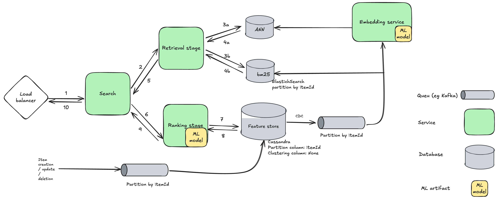

# Search System Design

## 1. Clarify and Requirements
**Problem Statement:**  
Design a scalable search system that allows users to search for products in an e-commerce platform.

**Functional Requirements:**  
- Users can input queries to search for products.  
- Support for text based search.  
- Ranking of search results based on relevance.

**Non-Functional Requirements:**  
- High availability and low latency (sub-second responses).  
- Scalability to handle millions of users and products.  
- Fault tolerance and data consistency.

**Constraints:**  
- Must support real-time indexing of new products.  
- Multi-language support for global users.

**Possible questions to ask**

## 2. Scale Numbers
- Daily Active Users (DAU): 10 million
- Peak Queries Per Second (QPS): 50,000
- Product Catalog Size: 100 million items
- Expected Latency: < 200ms for search results

## 3. Metrics
**Offline Metrics:**  
- Precision, Recall, F1-score  
- Mean Reciprocal Rank (MRR)  
- Normalized Discounted Cumulative Gain (NDCG)

**Online Metrics (A/B Testing):**  
- Click-Through Rate (CTR)  
- Conversion Rate  
- Time to First Result  
- Bounce Rate

## 4. High-Level Design
At this scale, a search system must consist of at least two core stages: **Retrieval** and **Ranking**.

- **Retrieval:** A simple yet highly scalable step focusing on optimizing recall. The goal is to fetch the top few hundred relevant items for a given query.
- **Ranking:** This stage refines the results for precision and relevance. It leverages more complex models and cross-features, making it computationally more expensive.

### 4.1 Retrieval Stage
The standard baseline for retrieval is token matching, commonly implemented with **BM25** powered by **Elasticsearch**. Another option is embedding-based retrieval methods.

**Pros of BM25:**
- Extensive industry knowledge and documentation.
- Simple to debug and interpret.
- Highly scalable and adaptable to business logic (e.g., boosting product price or availability).

**Cons of BM25:**
- Struggles with understanding semantic meaning.
- Limited handling of synonyms and contextual queries.

**Pros of Embedding-Based Methods:**
- Captures richer semantic relationships in queries.
- Handles synonyms, paraphrasing, and contextual variations better.

**Cons of Embedding-Based Methods:**
- More complex to maintain and update.
- Vector databases (e.g., Faiss, Milvus) are relatively new and require specialized infrastructure.

**Hybrid Approach:**
A combination of token matching, embedding-based retrieval, and rule-based filtering often yields the best results.

**Models for Retrieval:**
- **BM25** (Elasticsearch, Apache Solr)
- **Two-Tower Models** (Deep retrieval using dual encoders)  
  *Reference: [Google's Deep Retrieval Models](https://arxiv.org/abs/2007.00808)*
- **Sentence-Transformers** (e.g., SBERT for semantic search)
- **Dense Passage Retrieval (DPR)**

### 4.2 Ranking Stage
Ranking is more computationally expensive due to the incorporation of complex features and models. The advantage lies in using cross-features, either through manual feature engineering or deep models with cross-interactions.

**Models for Ranking:**
- **Gradient Boosting Machines (GBM):** LightGBM, XGBoost for tabular and structured data.
- **Logistic Regression & SVM:** For interpretable and lightweight models.
- **Neural Ranking Models:**
  - **Cross-Attention Models** (e.g., BERT-based re-rankers)
  - **Cross Network Models** (combining feature interactions)
  - **Deep Neural Networks (DNNs)** for capturing complex relationships.
- **Wide & Deep Models:** Combining memorization (wide) and generalization (deep).

**Feature Examples:**
- Textual relevance scores (from retrieval stage)
- Click-through and engagement metrics
- Product popularity and pricing
- User behavior and personalization features

By balancing retrieval for speed and recall with ranking for precision and relevance, this two-stage approach ensures efficient and high-quality search results.

### 4.3 Serving Architecture
To support scalability and low-latency, different serving architectures can be employed:

**1. Orchestrator-Based Architecture:**
- **Load Balancer (LB):** Distributes incoming search queries.
- **Orchestrator:** Coordinates the workflow by first calling the **Retrieval Service** and then passing the results to the **Ranking Service**.
- **Retrieval Service:** Fetches a set of candidate items.
- **Ranking Service:** Ranks the candidates based on complex models and features.

**Pros:** Modular, flexible, easier to scale individual components.

**2. Monolithic Architecture:**
- **Load Balancer (LB):** Directly routes traffic to a single service that handles both retrieval and ranking in one process.

**Pros:** Simpler to implement and manage at small scale.
**Cons:** Harder to scale and maintain as complexity grows.

**3. Ranking-Driven Architecture:**
- **Load Balancer (LB):** Routes requests to the **Ranking Service**.
- **Ranking Service:** Directly calls the **Retrieval Service** for candidate generation, then ranks results.

**Pros:** Centralizes ranking logic, reduces orchestration overhead.
**Cons:** Tight coupling between retrieval and ranking layers.

By selecting the appropriate serving architecture, the system can achieve the desired balance between scalability, flexibility, and performance.

### 4.4 Training Architecture
To ensure model effectiveness, a robust training architecture must be implemented for both **Retrieval** and **Ranking** stages.

**Evaluating Retrieval Models:**
- Use metrics like **Recall@K**, **Mean Reciprocal Rank (MRR)**, and **Normalized Discounted Cumulative Gain (NDCG)**.
- Train with **time-aware splits** to prevent data leakage.
- Split data on **Query ID** to avoid overlapping queries between training and evaluation sets.

**Evaluating Ranking Models:**
- Use metrics such as **NDCG**, **Precision@K**, and **AUC-ROC** for ranking quality.
- Conduct **offline evaluations** with hold-out datasets.
- Implement **online A/B testing** to validate performance in production.

**Data Format:**
- **Retrieval:**
  - Query ID, Query Text
  - Document ID, Document Text
  - Label (Relevance score: 0/1)
- **Ranking:**
  - Query ID, Query Text
  - Candidate Document ID, Document Text
  - Features (clicks, price, popularity, personalization signals)
  - Label (Relevance score)

## 5. Feature Engineering
Feature engineering must align with both the **Retrieval** and **Ranking** stages:

**For Retrieval Models:**
- Text preprocessing (tokenization, stemming, stop-word removal).
- Synonym expansion and typo correction.
- Embedding generation for queries and documents.
- Category or taxonomy-based filtering.

**For Ranking Models:**
- Cross-feature engineering (query-product interactions).
- Behavioral data (click-through rates, dwell time).
- Product popularity, pricing, and availability.
- Personalization features (user history, preferences).

## 6. ML Modeling
Machine learning models are chosen based on their stage-specific roles:

**Retrieval Stage Models:**
- **BM25** for keyword matching.
- **Two-Tower Models** for semantic matching.
- **Sentence-Transformers** for contextual embeddings.
- **Dense Passage Retrieval (DPR)** for deep retrieval.

**Ranking Stage Models:**
- **Gradient Boosting Machines (LightGBM, XGBoost):** For structured and tabular features.
- **Cross-Attention Models (e.g., BERT):** For deep contextual relevance.
- **Wide & Deep Models:** To balance memorization and generalization.
- **Deep Neural Networks (DNNs):** For complex feature interaction.

By aligning feature engineering and modeling with retrieval and ranking, the system achieves a balance between scalability, performance, and relevance.

## 7. Scale Design
- Pending

## 8. Monitoring
- Query latency and error rate tracking.  
- Percentage of queries with no results
- Anomaly detection in search performance metrics.  
- Alerts for system downtimes and spikes in traffic.
